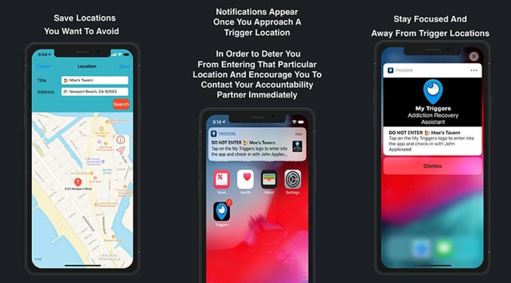

# MyTriggers
> Our mobile application is designed to assist you and facilitate your journey towards addiction recover

[![Swift Version][swift-image]][swift-url]

My Triggers: Accountability Assistant provides assistance to individuals over coming addiction by adding a layer of accountability.

Addiction recovery can be difficult when the individual goes through the journey alone. Too often an individual struggling with addiction relapses when they find themselves in a familiar location where they engage in the unwanted behavior. 

My Triggers provides you a map that allows you to track the locations you are trying to avoid that might trigger relapse or any other unwanted behavior. 

As you approach the identified location a notification appears prompting you to stay away and contact your support person.

Notes, contact information and trigger locations are saved to iCloud and synched with your other iCloud enabled devices.



## Features

- [x] Apple Maps 
- [x] CloudKit
- [x] Geo Location Notifications
- [x] Journal to track your sobriety mile stones
- [x] Feature 5

## Requirements

- iOS 12.1+
- Xcode 12

## Installation 

#### CloudKit
Make sure you're signed into your [iCloud](https://support.apple.com/en-us/HT203512) when testing application on your device or simulator.

## CloudKit Code Snippet 
Leveraging the power of CloudKit a User object has a link to all the elements down below
```swift
// code away!

class User {

var userName: String
var sponsorName: String?
var sponsorTelephoneNumber: String?
var sponsorEmail: String?
var aaStep: Int
var ckRecordID: CKRecord.ID?
var date: Date?
var appleUserRef: CKRecord.Reference
var targetLocations: [Location] = []
var folders: [Folder] = []
var notes: [Note] = []
...
}
```

## Let me know what you think

Ivan Ramirez – [@IvansTwitter](https://twitter.com/iramirezdev) – iramirez22ios@gmail.com

[swift-image]:https://img.shields.io/badge/swift-5.0-orange.svg
[swift-url]: https://swift.org/
